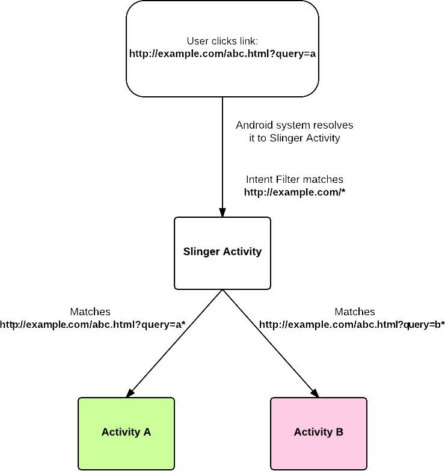

Slinger - deep linking library for Android 
====================

[](https://travis-ci.org/allegro/slinger)

Slinger is a small Android library for handling custom Uri which uses regular expression to
catch and route URLs which won’t be handled by normal [intent-filter](http://developer.android.com/guide/topics/manifest/data-element.html#path) mechanism.

With slinger it’s possible to provide deep links for quite complicated URLs.



## How do I use it?

Declare Activity in your manifest with your own `IntentResolver` that will handle links within particular domain.

```xml
<activity
  android:name="pl.allegro.android.slinger.SlingerActivity"
  android:excludeFromRecents="true"
  android:noHistory="true"
  android:theme="@style/android:Theme.NoDisplay">
  <meta-data
    android:name="IntentResolver"
    android:value="com.my.appp.ExampleIntentResolver"/>
    <intent-filter android:label="@string/app_name">
      <action android:name="android.intent.action.VIEW"/>
      <category android:name="android.intent.category.DEFAULT"/>
      <category android:name="android.intent.category.BROWSABLE"/>
      <data
        android:host="example.com"
        android:pathPattern="/.*"
        android:scheme="http"/>
    </intent-filter>
</activity>
```

`IntentResolver` is a class that redirects URLs to concrete Activities based on regular expressions.

```java

@Keep
public class ExampleIntentResolver extends IntentResolver {

  private List<RedirectRule> rules;

  public ExampleIntentResolver(Activity activity) {
    super(activity);
    rules = asList(getRedirectRuleForAboutActivity(activity));
  }

  private RedirectRule getRedirectRuleForAboutActivity(Activity activity) {
    return RedirectRule.builder()
                       .intent(new Intent(activity, MyConcreteActivityA.class))
                       .pattern("http://example.com/abc\\\\.html\\\\?query=a.*")
                       .build();
  }

  @NonNull @Override public Iterable<RedirectRule> getRules() {
    return rules;
  }
}
```

In case when no redirect rule is matched `IntentResolver` will fallback to default Intent - `Uri` with `ACTION_VIEW`.

## Customizing

### Matching Activities

In order to provide other mechanism than regular expression matching you can override `resolveIntentToSling` in `IntentResolver`

### Enriching Slinged Intents with Referrer and input URL

Slinger enriches Intents with URL and [referrer](http://developer.android.com/reference/android/app/Activity.html#getReferrer()) by default.
This can be changed by overriding `enrichIntent` in `IntentResolver`

```java
@Keep
public class ExampleIntentResolver extends IntentResolver {

  @NonNull
  @Override
  public Intent resolveIntentToSling(@NonNull Uri originatingUri) {
    // implement own intent resolving strategy here
    return super.resolveIntentToSling(originatingUri);
  }
  
  @Override
  public Intent enrichIntent(Activity parentActivity, Intent resolvedIntent, Uri originatingUri) {
    // enrich resolved intent with custom data
    return super.enrichIntent(parentActivity, resolvedIntent, originatingUri).putExtra("foo","bar");
  }
}
```

## Security considerations

Slinger does not sanitize input in any way. So providing security for application is your responsibility.

## License

**slinger** is published under [Apache License 2.0](http://www.apache.org/licenses/LICENSE-2.0).